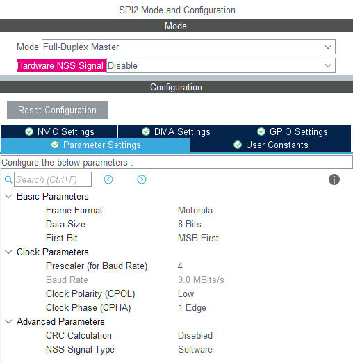
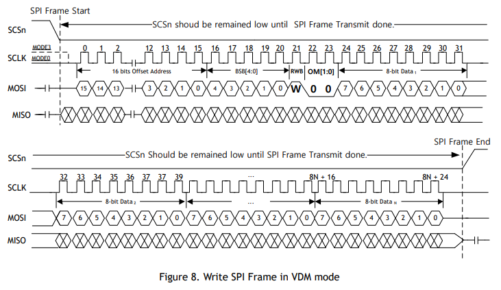
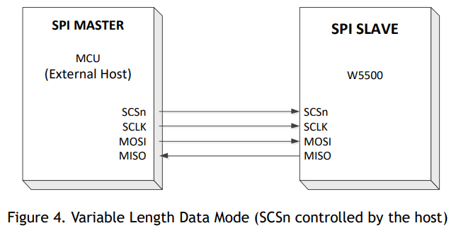
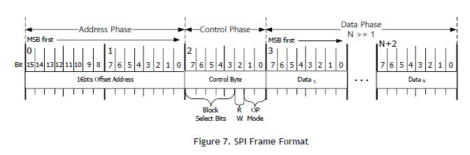

# STM32_ETH_W5500
WIZNET W5500 library connected over SPI.
## Microcontroller configuration
SPI Hardware configuration as follows



### Example code
```c
static void MX_SPI2_Init(void)
{

  /* USER CODE BEGIN SPI2_Init 0 */

  /* USER CODE END SPI2_Init 0 */

  /* USER CODE BEGIN SPI2_Init 1 */

  /* USER CODE END SPI2_Init 1 */
  /* SPI2 parameter configuration*/
  hspi2.Instance = SPI2;
  hspi2.Init.Mode = SPI_MODE_MASTER;
  hspi2.Init.Direction = SPI_DIRECTION_2LINES;
  hspi2.Init.DataSize = SPI_DATASIZE_8BIT;
  hspi2.Init.CLKPolarity = SPI_POLARITY_LOW;
  hspi2.Init.CLKPhase = SPI_PHASE_1EDGE;
  hspi2.Init.NSS = SPI_NSS_SOFT;
  hspi2.Init.BaudRatePrescaler = SPI_BAUDRATEPRESCALER_4;
  hspi2.Init.FirstBit = SPI_FIRSTBIT_MSB;
  hspi2.Init.TIMode = SPI_TIMODE_DISABLE;
  hspi2.Init.CRCCalculation = SPI_CRCCALCULATION_DISABLE;
  hspi2.Init.CRCPolynomial = 10;
  if (HAL_SPI_Init(&hspi2) != HAL_OK)
  {
    Error_Handler();
  }
  /* USER CODE BEGIN SPI2_Init 2 */

  /* USER CODE END SPI2_Init 2 */

}
```
## Device wiring

This device is able to transmit fixed and variables types.

Fixed data transmission is defined setting propper registers on W5500 chip "Control Phase SPI Operation Mode Bits OM[1:0]".

Variable data transmission is controlled via SCSn pin active low.







## Module communications.

Registers read/write procedure

	1 - Send 16 bit Address Phase (16bits) - register address (First High and then low)
	2 - Send Control Phase (8 bits) -  Byte composition is listed in the next image.
	3 - For read operation, you'll receive the data, in opposite you'll put the data to be written.



