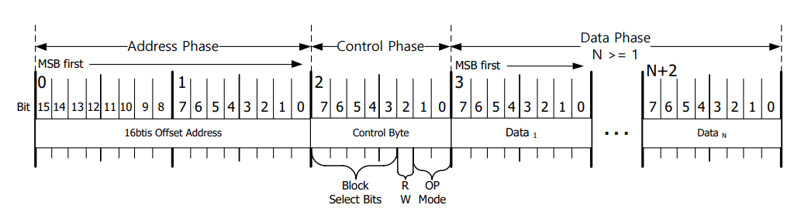

# STM32_ETH_W5500
Desarrollo de biblioteca para modulo WIZNET W5500 conectado por SPI.
## Configuracion del Micro 
El W5500 soporta comunicaciones SPI con un clock de hasta 14 MHZ, para este caso se setea un perscaler de 4 y se obtiene una freceuncia de clock de 9 MHz.
En pruebas realizadas a 18MHz se obervan errores en la lectura de datos.
`$ npm install marked`


### Código de ejemplo
```c
static void MX_SPI2_Init(void)
{

  /* USER CODE BEGIN SPI2_Init 0 */

  /* USER CODE END SPI2_Init 0 */

  /* USER CODE BEGIN SPI2_Init 1 */

  /* USER CODE END SPI2_Init 1 */
  /* SPI2 parameter configuration*/
  hspi2.Instance = SPI2;
  hspi2.Init.Mode = SPI_MODE_MASTER;
  hspi2.Init.Direction = SPI_DIRECTION_2LINES;
  hspi2.Init.DataSize = SPI_DATASIZE_8BIT;
  hspi2.Init.CLKPolarity = SPI_POLARITY_LOW;
  hspi2.Init.CLKPhase = SPI_PHASE_1EDGE;
  hspi2.Init.NSS = SPI_NSS_SOFT;
  hspi2.Init.BaudRatePrescaler = SPI_BAUDRATEPRESCALER_4;
  hspi2.Init.FirstBit = SPI_FIRSTBIT_MSB;
  hspi2.Init.TIMode = SPI_TIMODE_DISABLE;
  hspi2.Init.CRCCalculation = SPI_CRCCALCULATION_DISABLE;
  hspi2.Init.CRCPolynomial = 10;
  if (HAL_SPI_Init(&hspi2) != HAL_OK)
  {
    Error_Handler();
  }
  /* USER CODE BEGIN SPI2_Init 2 */

  /* USER CODE END SPI2_Init 2 */

}
```
## Conexion con el dispositivo

El dispositivo tiene la capacidad de comunicarse con longitud de tipo de datos variables y fijos.
La transmisión de datos fijos se definen por SPI, en cambio la lectura/escritura de datos variables se realiza
durante el estado bajo de esta señal.


Module communications.

Registers read/write procedure

	1 - Send 16 bit Address Phase (16bits) - register address (First High and then low)
	2 - Send Control Phase (8 bits) -  Byte composition is listed in the next image.
	3 - For read operation, you'll receive the data, in opposite you'll put the data to be written.


